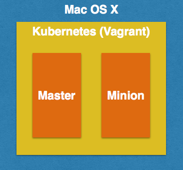
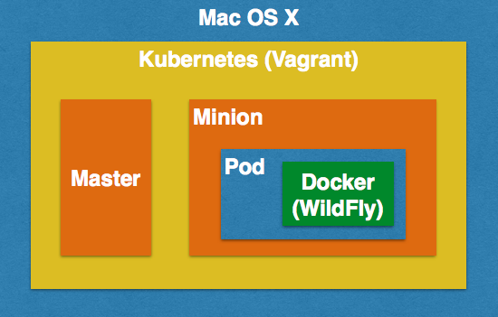
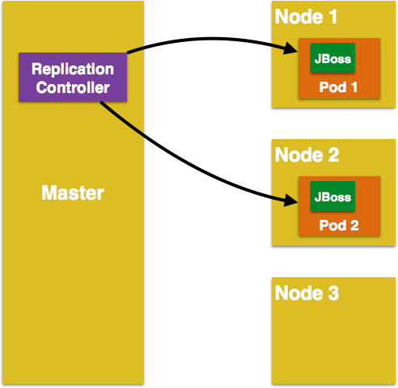
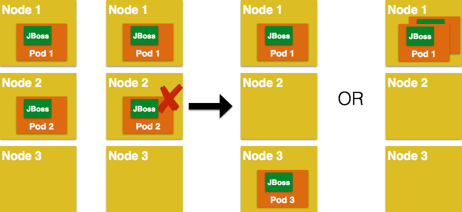
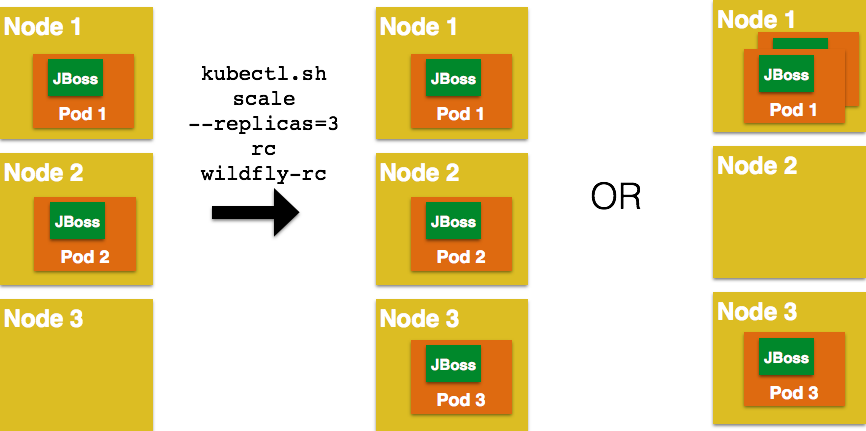
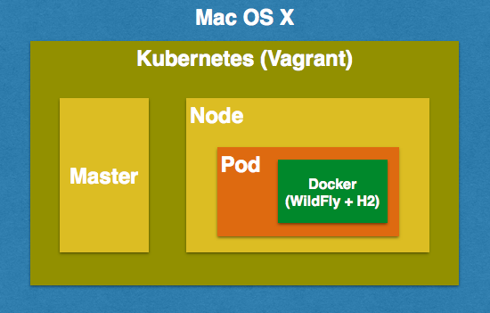
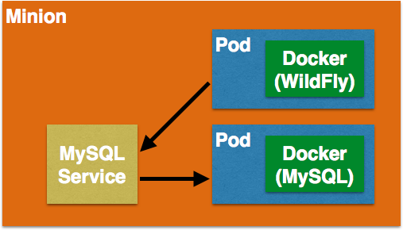

= Kubernetes Java Samples
:toc:
:toclevels: 3
:toc-placement!:

toc::[]

This project shows different recipes to run a Java EE application using Kubernetes.

== Kubernetes Concepts

Key concepts of Kubernetes are explained below:

. *Pods*: Collocated group of Docker containers that share an IP and storage volume
. *Service*: Single, stable name for a set of pods, also acts as load balancer
. *Replication Controller*: Manages the lifecycle of pods and ensures specified number are running
. *Labels*: Used to organize and select group of objects
. *etcd*: Distributed key-value store used to persist Kubernetes system state
. *Master*: Hosts cluster-level control services, including the API server, scheduler, and controller manager
. *Node*: Docker host running _kubelet_ (node agent) and proxy services
. *Kubelet*: It runs on each node in the cluster and is responsible for node level pod management.

.Kubernetes Architecture
image::images/kubernetes-architecture.png[]

== Initial setup

. Download Kubernetes from
  https://github.com/kubernetes/kubernetes/releases/download/v1.0.1/kubernetes.tar.gz
  and extract.
. Start Kubernetes using Vagrant

  cd kubernetes
  export KUBERNETES_PROVIDER=vagrant
  cluster/kube-up.sh

.Kubernetes Cluster using Vagrant

Detailed instructions:
https://github.com/kubernetes/kubernetes/blob/master/docs/getting-started-guides/vagrant.md

== A Pod with One Container

This section will explain how to start a Pod with one Container. WildFly base Docker image will be used as the Container.

.A Pod with One Container

. Start a Pod with WildFly container:

  kubernetes> ./cluster/kubectl.sh create -f ~/workspaces/kubernetes-java-sample/wildfly-pod.yaml

. Get status of the Pod:
+
[source, text]
----
kubernetes> ./cluster/kubectl.sh get -w po
NAME          READY     STATUS    RESTARTS   AGE
wildfly-pod   0/1       Pending   0          4s
wildfly-pod   0/1       Running   0          10s
NAME          READY     STATUS    RESTARTS   AGE
wildfly-pod   1/1       Running   0          10s
----
+
NOTE: Make sure to wait for the status to change to Running.
+
. Get complete details about the generated Pod (including IP address):
+
[source, text]
----
kubernetes> ./cluster/kubectl.sh describe po wildfly-pod
Name:				wildfly-pod
Namespace:			default
Image(s):			jboss/wildfly
Node:				10.245.1.3/10.245.1.3
Labels:				name=wildfly
Status:				Running
Reason:				
Message:			
IP:				10.246.1.15
Replication Controllers:	<none>
Containers:
  wildfly-pod:
    Image:	jboss/wildfly
    Limits:
      cpu:		100m
    State:		Running
      Started:		Tue, 14 Jul 2015 14:32:06 -0700
    Ready:		True
    Restart Count:	0
Conditions:
  Type		Status
  Ready 	True 
Events:
  FirstSeen				LastSeen			Count	From			SubobjectPath		Reason		Message
  Tue, 14 Jul 2015 14:32:04 -0700	Tue, 14 Jul 2015 14:32:04 -0700	1	{scheduler }					scheduled	Successfully assigned wildfly-pod to 10.245.1.3
  Tue, 14 Jul 2015 14:32:04 -0700	Tue, 14 Jul 2015 14:32:04 -0700	1	{kubelet 10.245.1.3}	implicitly required container POD	pulled		Pod container image "gcr.io/google_containers/pause:0.8.0" already present on machine
  Tue, 14 Jul 2015 14:32:05 -0700	Tue, 14 Jul 2015 14:32:05 -0700	1	{kubelet 10.245.1.3}	implicitly required container POD	created		Created with docker id 39722cdb6e81
  Tue, 14 Jul 2015 14:32:05 -0700	Tue, 14 Jul 2015 14:32:05 -0700	1	{kubelet 10.245.1.3}	implicitly required container POD	started		Started with docker id 39722cdb6e81
  Tue, 14 Jul 2015 14:32:06 -0700	Tue, 14 Jul 2015 14:32:06 -0700	1	{kubelet 10.245.1.3}	spec.containers{wildfly-pod}		created		Created with docker id dd410c76c15a
  Tue, 14 Jul 2015 14:32:06 -0700	Tue, 14 Jul 2015 14:32:06 -0700	1	{kubelet 10.245.1.3}	spec.containers{wildfly-pod}		started		Started with docker id dd410c76c15a
----
+
NOTE: IP address of the Pod is shown as 10.246.1.15.
+
Only the IP address can be obtained as:
+
[source, text]
----
kubernetes> ./cluster/kubectl.sh get -o template po wildfly-pod --template={{.status.podIP}}
----
+
. Check logs of the Pod:
+
[source, text]
----
kubernetes> ./cluster/kubectl.sh logs wildfly-pod
=========================================================================

  JBoss Bootstrap Environment

  JBOSS_HOME: /opt/jboss/wildfly

  JAVA: /usr/lib/jvm/java/bin/java

  JAVA_OPTS:  -server -XX:+UseCompressedOops  -server -XX:+UseCompressedOops -Xms64m -Xmx512m -XX:MaxPermSize=256m -Djava.net.preferIPv4Stack=true -Djboss.modules.system.pkgs=org.jboss.byteman -Djava.awt.headless=true

=========================================================================

OpenJDK 64-Bit Server VM warning: ignoring option MaxPermSize=256m; support was removed in 8.0
21:32:07,636 INFO  [org.jboss.modules] (main) JBoss Modules version 1.4.3.Final
21:32:07,944 INFO  [org.jboss.msc] (main) JBoss MSC version 1.2.6.Final
21:32:08,045 INFO  [org.jboss.as] (MSC service thread 1-7) WFLYSRV0049: WildFly Full 9.0.0.Final (WildFly Core 1.0.0.Final) starting

. . .

21:32:10,548 INFO  [org.jboss.as] (Controller Boot Thread) WFLYSRV0060: Http management interface listening on http://127.0.0.1:9990/management
21:32:10,548 INFO  [org.jboss.as] (Controller Boot Thread) WFLYSRV0051: Admin console listening on http://127.0.0.1:9990
21:32:10,549 INFO  [org.jboss.as] (Controller Boot Thread) WFLYSRV0025: WildFly Full 9.0.0.Final (WildFly Core 1.0.0.Final) started in 3386ms - Started 203 of 379 services (210 services are lazy, passive or on-demand)
----
. Pod's IP is accessible only inside the cluster. To access the WildFly server running in the Pod, login to the minion:
+
[source, text]
----
kubernetes> vagrant ssh minion-1
Last login: Tue Jul 14 21:29:24 2015 from 10.0.2.2
[vagrant@kubernetes-minion-1 ~]$ 
----
+
And check that WildFly container running inside the Pod is accessible:
+
[source, text]
----
[vagrant@kubernetes-minion-1 ~]$ curl http://10.246.1.15:8080
<!--
  ~ JBoss, Home of Professional Open Source.
  ~ Copyright (c) 2014, Red Hat, Inc., and individual contributors

. . .

    

</body>
</html>

----
+
. Delete the Pod:

  kubernetes> ./cluster/kubectl.sh delete -f ~/workspaces/kubernetes-java-sample/wildfly-pod.yaml

== A Replication Controller with Two Replicas of a Pod (WildFly)

This section will explain how to start a https://github.com/kubernetes/kubernetes/blob/master/docs/user-guide/replication-controller.md[Replication Controller] with two replicas of a Pod. Each Pod will have one WildFly container.

.Kubernetes Replication Controller

. Start a Replication Controller that has two replicas of a pod, each with a WildFly container:
+
[source, text]
----
kubernetes> ./cluster/kubectl.sh create -f ~/workspaces/kubernetes-java-sample/wildfly-rc.yaml 
----
. Get status of the Pods:
+
[source, text]
----
kubernetes> ./cluster/kubectl.sh get -w po
NAME      READY     STATUS    RESTARTS   AGE
NAME               READY     STATUS    RESTARTS   AGE
wildfly-rc-bgtkg   0/1       Pending   0          1s
wildfly-rc-l8fqv   0/1       Pending   0         1s
wildfly-rc-bgtkg   0/1       Pending   0         1s
wildfly-rc-l8fqv   0/1       Pending   0         1s
wildfly-rc-bgtkg   0/1       Pending   0         1s
wildfly-rc-l8fqv   0/1       Pending   0         1s
wildfly-rc-bgtkg   0/1       Running   0         1m
wildfly-rc-l8fqv   0/1       Running   0         1m
wildfly-rc-bgtkg   1/1       Running   0         1m
wildfly-rc-l8fqv   1/1       Running   0         1m
----
+
NOTE: Make sure to wait for the status to change to Running.
+
Note down name of the Pods as "`wildfly-rc-bgtkg`" and "`wildfly-rc-l8fqv`".
+
. Get status of the Replication Controller:
+
[source, text]
----
kubernetes> ./cluster/kubectl.sh get rc
CONTROLLER   CONTAINER(S)     IMAGE(S)        SELECTOR       REPLICAS
wildfly-rc   wildfly-rc-pod   jboss/wildfly   name=wildfly   2
----
+
If multiple Replication Controllers are running then you can query for this specific one using the label:
+
[source, text]
----
kubernetes> ./cluster/kubectl.sh get rc -l name=wildfly
CONTROLLER   CONTAINER(S)     IMAGE(S)        SELECTOR       REPLICAS
wildfly-rc   wildfly-rc-pod   jboss/wildfly   name=wildfly   2
----
+
. Find IP address of each Pod (using the name):
+
[source, text]
----
kubernetes> ./cluster/kubectl.sh get -o template po wildfly-rc-bgtkg --template={{.status.podIP}}
10.246.1.5
----
+
Find IP address of the other Pod:
+
[source, text]
----
kubernetes> ./cluster/kubectl.sh get -o template po wildfly-rc-l8fqv --template={{.status.podIP}}
10.246.1.4
----
+
. As mentioned earlier, Pod's IP address is accessible only inside the cluster. Login to the minion to access WildFly's main page hosted by the containers:
+
[source, text]
----
kubernetes> vagrant ssh minion-1
Last login: Wed Jul 15 20:39:23 2015 from 10.0.2.2
[vagrant@kubernetes-minion-1 ~]$ curl http://10.246.1.4:8080/
<!--
  ~ JBoss, Home of Professional Open Source.

. . .

</body>
</html>
[vagrant@kubernetes-minion-1 ~]$ curl http://10.246.1.5:8080/
<!--
  ~ JBoss, Home of Professional Open Source.

. . .

</body>
</html>
----

=== Rescheduling Pods

Replication Controller ensures that specified number of pod "`replicas`" are running at any one time. If there are too many, the replication controller kills some pods. If there are too few, it starts more.

.Rescheduling Pods in Kubernetes

Lets start a Replication Controller with a couple of Pods. Delete a Pod and see how a new Pod is automatically rescheduled.

[source, text]
----
kubernetes> ./cluster/kubectl.sh delete po wildfly-rc-l8fqv
pods/wildfly-rc-l8fqv
----

Status of the Pods can be seen in another shell:

[source, text]
----
kubernetes> ./cluster/kubectl.sh get -w po
NAME               READY     STATUS    RESTARTS   AGE
wildfly-rc-bgtkg   1/1       Running   0          2m
wildfly-rc-l8fqv   1/1       Running   0          2m
NAME               READY     STATUS    RESTARTS   AGE
wildfly-rc-l8fqv   1/1       Running   0          3m
wildfly-rc-xz6wu   0/1       Pending   0         2s
wildfly-rc-xz6wu   0/1       Pending   0         2s
wildfly-rc-xz6wu   0/1       Pending   0         12s
wildfly-rc-xz6wu   0/1       Running   0         14s
wildfly-rc-xz6wu   1/1       Running   0         22s
----

Notice how Pod with name "`wildfly-rc-bgtkg`" was deleted and a new Pod with the name "`wildfly-rc-xz6wu`" was created.

=== Scaling Pods

Replication Controller allows dynamic scaling up and down of Pods.

.Scaling Pods in Kubernetes

. Scale up the number of Pods:
+
[source, text]
----
kubernetes> ./cluster/kubectl.sh scale --replicas=3 rc wildfly-rc
scaled
----
+
. Status of the Pods can be seen in another shell:
+
[source, text]
----
kubernetes> ./cluster/kubectl.sh get -w po
NAME               READY     STATUS    RESTARTS   AGE
wildfly-rc-bgtkg   1/1       Running   0          3m
wildfly-rc-xz6wu   1/1       Running   0          38s
NAME               READY     STATUS    RESTARTS   AGE
wildfly-rc-bymu7   0/1       Pending   0          2s
wildfly-rc-bymu7   0/1       Pending   0         2s
wildfly-rc-bymu7   0/1       Pending   0         2s
wildfly-rc-bymu7   0/1       Running   0         3s
wildfly-rc-bymu7   1/1       Running   0         12s
----
+
Notice a new Pod with the name "`wildfly-rc-bymu7`" is created.
+
. Scale down the number of Pods:
+
[source, text]
----
kubernetes> ./cluster/kubectl.sh scale --replicas=1 rc wildfly-rc
scaled
----
+
. Status of the Pods using `-w` is not shown correctly https://github.com/kubernetes/kubernetes/issues/11338[#11338]. But status of the Pods can be seen correctly as:
+
[source, text]
----
kubernetes> ./cluster/kubectl.sh get po
NAME               READY     STATUS    RESTARTS   AGE
wildfly-rc-bgtkg   1/1       Running   0          9m
----
+
Notice only one Pod is running now.

=== Rolling Updates

PR for https://github.com/arun-gupta/kubernetes-java-sample/issues/1

=== Multiple Release Tracks

PR for https://github.com/arun-gupta/kubernetes-java-sample/issues/2

=== Delete the Replication Controller

Finally, delete the Replication Controller:

[source, text]
----
kubernetes> ./cluster/kubectl.sh delete -f ~/workspaces/kubernetes-java-sample/wildfly-rc.yaml
----

== Java EE Application deployed in a Pod with one Container (WildFly + H2 in-memory database)

This section will show how to deploy a Java EE application in a Pod with one Container. WildFly, with an in-memory H2 database, will be used as the container.

.Java EE Application in Kubernetes

. Create Java EE 7 sample application Replication Controller:
+
[source, text]
----
kubernetes> ./cluster/kubectl.sh create -f ~/workspaces/kubernetes-java-sample/javaee7-hol.yaml
replicationcontrollers/javaee7-hol
----
+
. Get status of the Pod:
+
[source, text]
----
kubernetes> ./cluster/kubectl.sh get -w po
NAME                READY     STATUS    RESTARTS   AGE
javaee7-hol-kt6bw   0/1       Pending   0          3s
javaee7-hol-kt6bw   0/1       Pending   0          5s
javaee7-hol-kt6bw   0/1       Running   0         7s
javaee7-hol-kt6bw   1/1       Running   0         15s
----
+
NOTE: Make sure to wait for the status to change to Running.
+
. Get status of the Replication Controller:
+
[source, text]
----
kubernetes> ./cluster/kubectl.sh get rc
CONTROLLER    CONTAINER(S)   IMAGE(S)                SELECTOR           REPLICAS
javaee7-hol   master         arungupta/javaee7-hol   name=javaee7-hol   1
----
+
. Find IP address of the pod as:
+
[source, text]
----
kubernetes> ./cluster/kubectl.sh get -o template po javaee7-hol-kt6bw --template={{.status.podIP}}
----

+
. As mentioned earlier, Pod's IP address is accessible only inside the cluster. Login to the minion to access application's main page hosted by the containers:
+
[source, text]
----
kubernetes> vagrant ssh minion-1
Last login: Tue Jul 14 21:35:12 2015 from 10.0.2.2
[vagrant@kubernetes-minion-1 ~]$ curl http://10.246.1.104:8080/movieplex7/
<?xml version='1.0' encoding='UTF-8'?>
<!DOCTYPE html>
 ...
</html>
----
+
. Check logs of the Pod using the pod's name:
+
[source, text]
----
kubernetes> ./cluster/kubectl.sh logs javaee7-hol-kt6bw
W0715 10:07:53.235698   14344 cmd.go:149] log is DEPRECATED and will be removed in a future version. Use logs instead.
=========================================================================

  JBoss Bootstrap Environment

  JBOSS_HOME: /opt/jboss/wildfly

  JAVA: /usr/lib/jvm/java/bin/java

. . .

17:03:12,322 INFO  [org.wildfly.extension.undertow] (ServerService Thread Pool -- 64) WFLYUT0021: Registered web context: /movieplex7
17:03:12,369 INFO  [org.jboss.as.server] (ServerService Thread Pool -- 37) WFLYSRV0010: Deployed "movieplex7-1.0-SNAPSHOT.war" (runtime-name : "movieplex7-1.0-SNAPSHOT.war")
17:03:12,515 INFO  [org.jboss.as] (Controller Boot Thread) WFLYSRV0060: Http management interface listening on http://127.0.0.1:9990/management
17:03:12,516 INFO  [org.jboss.as] (Controller Boot Thread) WFLYSRV0051: Admin console listening on http://127.0.0.1:9990
17:03:12,516 INFO  [org.jboss.as] (Controller Boot Thread) WFLYSRV0025: WildFly Full 9.0.0.Final (WildFly Core 1.0.0.Final) started in 11951ms - Started 437 of 607 services (233 services are lazy, passive or on-demand)
----

=== Access the Application on Host

. `javaee7-hol.yaml` configuration file also exposes the `hostPort` on 8080. This allows port 8080 exposed by container to be forwarded at the port 8080 of the host.
+
NOTE: It is not recommended to publish `hostPort` as other Pods may try to use that port as well, and this will cause contention.
+
Get IP address of the host as:
+
[source, text]
----
kubernetes> ./cluster/kubectl.sh get -o=wide po
NAME                READY     STATUS    RESTARTS   AGE       NODE
javaee7-hol-kt6bw   1/1       Running   0          8m        10.245.1.3
----
+
. Access the application on host as:
+
[source, text]
----
kubernetes> curl http://10.245.1.3:8080/movieplex7/
<?xml version='1.0' encoding='UTF-8'?>
<!DOCTYPE html>
<!-- 
/*

. . .

            

                Showing 20 movies in 7 theaters!
            
            

        
</body>

</html>
----

=== Delete the Replication Controller

. Delete the Replication Controller:

[source, text]
----
kubernetes> ./cluster/kubectl.sh delete -f ~/workspaces/kubernetes-java-sample/javaee7-hol.yaml
replicationcontrollers/javaee7-hol
----

== Kubernetes Service

Pods are ephemeral. IP address assigned to a Pod cannot be relied upon. Kubernetes, Replication Controller in particular, create and destroy Pods dynamically. A _consumer_ Pod cannot rely upon the IP address of a _producer_ Pod.

https://github.com/kubernetes/kubernetes/blob/master/docs/user-guide/services.md[Kubernetes Service] is an abstraction which defines a set of logical Pods. The set of Pods targeted by a Service are determined by labels associated with the Pods.

This section will show how to run a WildFly and MySQL containers in separate Pods. WildFly Pod will talk to the MySQL Pod using a Service.

.Kubernetes Service

The order of Service and the targeted Pods does not matter. However Service needs to be started before any other Pods consuming the Service are started.

. Start MySQL Pod:
+
[source, text]
----
kubernetes> ./cluster/kubectl.sh create -f ~/workspaces/kubernetes-java-sample/app-mysql-pod.yaml 
pods/mysql-pod
----
+
. Get status of the Pod:
+
[source, text]
----
kubernetes> ./cluster/kubectl.sh get -w po
NAME        READY     STATUS    RESTARTS   AGE
mysql-pod   0/1       Pending   0          4s
mysql-pod   0/1       Running   0          44s
mysql-pod   1/1       Running   0          44s
----
+
. Start MySQL Service:
+
[source, text]
----
kubernetes> ./cluster/kubectl.sh create -f ~/workspaces/kubernetes-java-sample/app-mysql-service.yaml
services/mysql-service
----
+
. Get status of the Service:
+
[source, text]
----
kubernetes> ./cluster/kubectl.sh get -w se
NAME            LABELS                                    SELECTOR                                IP(S)          PORT(S)
kubernetes      component#apiserver,provider=kubernetes   <none>                                  10.247.0.1     443/TCP
mysql-service   context=docker-k8s-lab,name=mysql-pod     context=docker-k8s-lab,name=mysql-pod   10.247.63.43   3306/TCP
----
+
If multiple services are running, pods status can be narrowed by specifying labels:
+
[source, text]
----
kubernetes> ./cluster/kubectl.sh  get -w po -l context=docker-k8s-lab,name=mysql-pod
NAME        READY     STATUS    RESTARTS   AGE
mysql-pod   1/1       Running   0          4m
----
+
This is also the selector label used by Service to target Pods.
+
When a Service is run on a node, the kubelet adds a set of environment variables for each active Service. It supports both Docker links compatible variables and simpler `{SVCNAME}_SERVICE_HOST` and `{SVCNAME}_SERVICE_PORT` variables, where the Service name is upper-cased and dashes are converted to underscores.
+
Our service name is "`mysql-service`" and so `MYSQL_SERVICE_SERVICE_HOST` and `MYSQL_SERVICE_SERVICE_PORT` variables are available to other pods.
+
. Start WildFly Replication Controller:
+
[source, text]
----
kubernetes> ./cluster/kubectl.sh create -f ~/workspaces/kubernetes-java-sample/app-wildfly-rc.yaml
replicationcontrollers/wildfly-rc
----
+
. Check the status of Pod inside Replication Controller:
+
[source, text]
----
kubernetes> ./cluster/kubectl.sh get po
NAME               READY     STATUS    RESTARTS   AGE
mysql-pod          1/1       Running   0          1h
wildfly-rc-w2kk5   1/1       Running   0          6m
----
+
. Get IP address of the Pod:
+
[source, text]
----
kubernetes> ./cluster/kubectl.sh get -o template po wildfly-rc-w2kk5 --template={{.status.podIP}}
10.246.1.23
----
+
. Log in to minion and access the application:
+
[source, text]
----
kubernetes> vagrant ssh minion-1
Last login: Thu Jul 16 00:24:36 2015 from 10.0.2.2
[vagrant@kubernetes-minion-1 ~]$ curl http://10.246.1.23:8080/employees/resources/employees/
<?xml version="1.0" encoding="UTF-8" standalone="yes"?><collection><employee><id>1</id><name>Penny</name></employee><employee><id>2</id><name>Sheldon</name></employee><employee><id>3</id><name>Amy</name></employee><employee><id>4</id><name>Leonard</name></employee><employee><id>5</id><name>Bernadette</name></employee><employee><id>6</id><name>Raj</name></employee><employee><id>7</id><name>Howard</name></employee><employee><id>8</id><name>Priya</name></employee></collection>
----

== Kubernetes Application

Kubernetes allow multiple resources to be specified in a single configuration file. This allows to create a "`Kubernetes Application`" that can consists of multiple resources easily.

Previous section showed how to deploy the Java EE application using multiple configuration files. This application can be delpoyed using a single configuration file as well.

. Start the application using the configuration file:
+
[source, yaml]
....
apiVersion: v1
kind: Pod
metadata:
  name: mysql-pod
  labels:
    name: mysql-pod
    context: docker-k8s-lab
spec:
  containers:
    -
      name: mysql
      image: mysql:latest
      env:
        -
          name: "MYSQL_USER"
          value: "mysql"
        -
          name: "MYSQL_PASSWORD"
          value: "mysql"
        -
          name: "MYSQL_DATABASE"
          value: "sample"
        -
          name: "MYSQL_ROOT_PASSWORD"
          value: "supersecret"
      ports:
        -
          containerPort: 3306
----
apiVersion: v1
kind: Service
metadata:
  name: mysql-service
  labels:
    name: mysql-pod
    context: docker-k8s-lab
spec:
  ports:
    # the port that this service should serve on
    - port: 3306
  # label keys and values that must match in order to receive traffic for this service
  selector:
    name: mysql-pod
    context: docker-k8s-lab
----
apiVersion: v1
kind: ReplicationController
metadata:
  name: wildfly-rc
  labels:
    name: wildfly
    context: docker-k8s-lab
spec:
  replicas: 1
  template:
    metadata:
      labels:
        name: wildfly
    spec:
      containers:
      - name: wildfly-rc-pod
        image: arungupta/wildfly-mysql-javaee7:k8s
        ports:
        - containerPort: 8080
....
+
Notice that each section, one each for MySQL Pod, MySQL Service, and WildFly Replication Controller, is separated by `----`.
+
. Start the application:
+
[source, text]
----
./cluster/kubectl.sh create -f ~/workspaces/kubernetes-java-sample/app.yaml
pods/mysql-pod
services/mysql-service
replicationcontrollers/wildfly-rc
----
+
. Application can accessed by logging into minion as explained in the previous section.

== Router front-ending the Service

TODO

== Kubernetes Volumes

http://kubernetes.io/v1.0/docs/user-guide/volumes.html

== Kubernetes Application Health Checks

http://kubernetes.io/v1.0/docs/user-guide/walkthrough/k8s201.html#health-checking

Kubernetes cluster checks if the container process is still running, and if not, the container process is restarted. This basic level of health checking is already enabled for all containers running in the Kubernetes cluster. This health check is performed by Kubelet.

In addition, it also enables user implemented application health checks. These checks are performed by the Kubernetes cluster to ensure that the application is running "`correctly`" provided by the application.

Currently there are three types of application health checks.

. HTTP Health Checks
. Container Exec
. TCP Socket

=== Kubernetes HTTP Health Check

=== Kubernetes Container Exec Health Check

=== Kubernetes TCP Socket Health Check

== OpenShift

http://blog.arungupta.me/openshift-v3-getting-started-javaee7-wildfly-mysql/

== Fabric 8

=== Console

Allows to package and deploy application using a Console

=== Visualization of resources

=== Inject Kubernetes resources using @Inject

=== Maven plugin to generate JSON for your WAR file

=== Deploy application to Kubernetes
