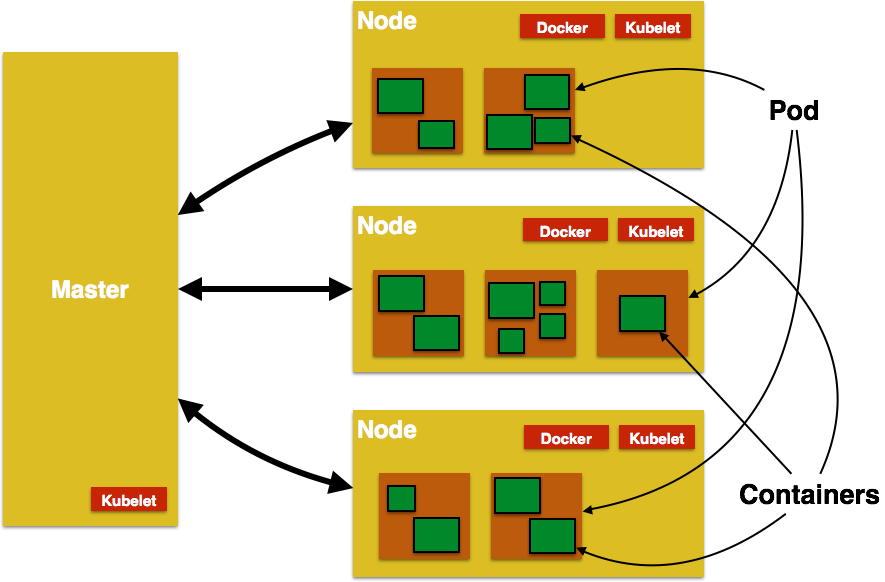

= Kubernetes Java Workshop
:toc:
:toclevels: 3
:toc-placement!:

toc::[]

This project shows different recipes to run a Java EE application using Kubernetes.

== Kubernetes Concepts

Key concepts of Kubernetes are explained below:

. *Pods*: Collocated group of Docker containers that share an IP and storage volume
. *Service*: Single, stable name for a set of pods, also acts as load balancer
. *Replication Controller*: Manages the lifecycle of pods and ensures specified number are running
. *Labels*: Used to organize and select group of objects
. *etcd*: Distributed key-value store used to persist Kubernetes system state
. *Master*: Hosts cluster-level control services, including the API server, scheduler, and controller manager
. *Node*: Docker host running _kubelet_ (node agent) and proxy services
. *Kubelet*: It runs on each node in the cluster and is responsible for node level pod management.

.Kubernetes Architecture


== Create Kubernetes Cluster

=== Using Minikube

This will create a one node development cluster.

. Download https://github.com/kubernetes/minikube/releases[latest minikube release]
. Download http://kubernetes.io/docs/getting-started-guides/minikube/#install-kubectl[latest kubectl]
. Move both binaries in the same directory and include that directory in the `PATH`.
. Start Kubernetes one node cluster:
+
  minikube start
+
Detailed instructions: http://kubernetes.io/docs/getting-started-guides/minikube/

=== Using Kops on Amazon Web Services

This will create a one master and two worker nodes cluster on AWS.

. Install Kops: `brew update && brew install kops && brew install kubectl`. Check Kops version `kops version`. Make sure its `1.6.2` at least.
. http://docs.aws.amazon.com/cli/latest/userguide/cli-chap-getting-started.html[Configure AWS CLI]
. Create IAM group: `aws iam create-group --group-name kops`
. Attach policy:
+
```
aws iam attach-group-policy --policy-arn arn:aws:iam::aws:policy/AmazonEC2FullAccess --group-name kops
aws iam attach-group-policy --policy-arn arn:aws:iam::aws:policy/AmazonRoute53FullAccess --group-name kops
aws iam attach-group-policy --policy-arn arn:aws:iam::aws:policy/AmazonS3FullAccess --group-name kops
aws iam attach-group-policy --policy-arn arn:aws:iam::aws:policy/IAMFullAccess --group-name kops
aws iam attach-group-policy --policy-arn arn:aws:iam::aws:policy/AmazonVPCFullAccess --group-name kops
```
+
. Create IAM user: `aws iam create-user --user-name kops`
. Add user to group: `aws iam add-user-to-group --user-name kops --group-name kops`
. Create keys for the user: `aws iam create-access-key --user-name kops`. Note down `SecretAccessKey` and `AccessKeyId`
. Configure AWS CLI: `aws configure`. Use `SecretAccessKey` and `AccessKeyId`
. Export keys:
+
```
export AWS_ACCESS_KEY_ID=<KEY>
export AWS_SECRET_ACCESS_KEY=<KEY>
```
+
. Create S3 bucket: `aws s3api create-bucket --bucket kubernetes-arungupta-me --region us-west-2`
. Enable bucket versioning: `aws s3api put-bucket-versioning --bucket kubernetes-arungupta-me --region us-west-2 --versioning-configuration Status=Enabled`
. Set S3 bucket: `export KOPS_STATE_STORE=s3://kubernetes-arungupta-me`
. Set cluster name: `export NAME=cluster.k8s.local`
. Start Kubernetes cluster on AWS
+
```
kops create cluster \
${NAME} \
--zones us-east-1a \
--yes
```
+
It shows the output as:
+
```
I0703 12:10:25.700774   36281 create_cluster.go:655] Inferred --cloud=aws from zone "us-east-1a"
I0703 12:10:25.701240   36281 create_cluster.go:841] Using SSH public key: /Users/argu/.ssh/id_rsa.pub
I0703 12:10:26.175659   36281 subnets.go:183] Assigned CIDR 172.20.32.0/19 to subnet us-east-1a
I0703 12:10:28.930005   36281 apply_cluster.go:396] Gossip DNS: skipping DNS validation
I0703 12:10:29.709277   36281 executor.go:91] Tasks: 0 done / 67 total; 32 can run
I0703 12:10:30.619598   36281 vfs_castore.go:422] Issuing new certificate: "kops"
I0703 12:10:30.637415   36281 vfs_castore.go:422] Issuing new certificate: "kube-scheduler"
I0703 12:10:30.961460   36281 vfs_castore.go:422] Issuing new certificate: "kube-proxy"
I0703 12:10:31.088121   36281 vfs_castore.go:422] Issuing new certificate: "kube-controller-manager"
I0703 12:10:31.198301   36281 vfs_castore.go:422] Issuing new certificate: "kubecfg"
I0703 12:10:31.371058   36281 vfs_castore.go:422] Issuing new certificate: "kubelet"
I0703 12:10:32.717984   36281 executor.go:91] Tasks: 32 done / 67 total; 13 can run
I0703 12:10:34.007905   36281 executor.go:91] Tasks: 45 done / 67 total; 18 can run
I0703 12:10:35.182359   36281 launchconfiguration.go:320] waiting for IAM instance profile "masters.cluster.k8s.local" to be ready
I0703 12:10:35.226575   36281 launchconfiguration.go:320] waiting for IAM instance profile "nodes.cluster.k8s.local" to be ready
I0703 12:10:45.933390   36281 executor.go:91] Tasks: 63 done / 67 total; 3 can run
I0703 12:10:47.189627   36281 vfs_castore.go:422] Issuing new certificate: "master"
I0703 12:10:47.527929   36281 executor.go:91] Tasks: 66 done / 67 total; 1 can run
I0703 12:10:47.888263   36281 executor.go:91] Tasks: 67 done / 67 total; 0 can run
I0703 12:10:48.289931   36281 update_cluster.go:229] Exporting kubecfg for cluster
Kops has set your kubectl context to cluster.k8s.local

Cluster is starting.  It should be ready in a few minutes.

Suggestions:
 * validate cluster: kops validate cluster
 * list nodes: kubectl get nodes --show-labels
 * ssh to the master: ssh -i ~/.ssh/id_rsa admin@api.cluster.k8s.local
The admin user is specific to Debian. If not using Debian please use the appropriate user based on your OS.
 * read about installing addons: https://github.com/kubernetes/kops/blob/master/docs/addons.md
```
+
. Wait for a few minutes and then validate the cluster: `kops validate cluster`:
+
```
Using cluster from kubectl context: cluster.k8s.local

Validating cluster cluster.k8s.local

INSTANCE GROUPS
NAME      ROLE  MACHINETYPE MIN MAX SUBNETS
master-us-east-1a Master  m3.medium 1 1 us-east-1a
nodes     Node  t2.medium 2 2 us-east-1a

NODE STATUS
NAME        ROLE  READY
ip-172-20-49-102.ec2.internal node  True
ip-172-20-58-69.ec2.internal  node  True
ip-172-20-61-237.ec2.internal master  True

Your cluster cluster.k8s.local is ready
```
+
. Get nodes in the cluster using `kubectl get nodes`:
+
```
NAME                            STATUS         AGE       VERSION
ip-172-20-49-102.ec2.internal   Ready,node     1m        v1.6.2
ip-172-20-58-69.ec2.internal    Ready,node     1m        v1.6.2
ip-172-20-61-237.ec2.internal   Ready,master   2m        v1.6.2
```

Detailed instructions: https://github.com/kubernetes/kops/blob/master/docs/aws.md

== Manage Pod

This section will explain how to start a Pod with one Container. WildFly base Docker image will be used as the Container.

. Start a Pod with WildFly container:
+
[source, text]
----
kubectl create -f wildfly-pod.yaml
pod "wildfly-pod" created
----
+
. Get status of the Pod:
+
[source, text]
----
kubectl get -w po
NAME          READY     STATUS              RESTARTS   AGE
wildfly-pod   0/1       ContainerCreating   0          <invalid>
wildfly-pod   1/1       Running             0          7s
----
+
NOTE: Make sure to wait for the status to change to Running.
+
. Get complete details about the generated Pod (including IP address):
+
```
kubectl describe po wildfly-pod
Name:   wildfly-pod
Namespace:  default
Node:   ip-172-20-58-69.ec2.internal/172.20.58.69
Start Time: Mon, 03 Jul 2017 13:05:36 -0700
Labels:   name=wildfly
Annotations:  kubernetes.io/limit-ranger=LimitRanger plugin set: cpu request for container wildfly-pod
Status:   Running
IP:   100.96.2.3
Controllers:  <none>
Containers:
  wildfly-pod:
    Container ID: docker://e21a5bcc80d4e90504281dcfcb455f6048460253961c14015f8b3c1086b30a3d
    Image:    jboss/wildfly
    Image ID:   docker-pullable://jboss/wildfly@sha256:09310f9ed677e8358f7733ab9a57cf8001fb67b06ff8d1ee309eafd9987c2626
    Port:   8080/TCP
    State:    Running
      Started:    Mon, 03 Jul 2017 13:05:57 -0700
    Ready:    True
    Restart Count:  0
    Requests:
      cpu:    100m
    Environment:  <none>
    Mounts:
      /var/run/secrets/kubernetes.io/serviceaccount from default-token-s16h5 (ro)
Conditions:
  Type    Status
  Initialized   True 
  Ready   True 
  PodScheduled  True 
Volumes:
  default-token-s16h5:
    Type: Secret (a volume populated by a Secret)
    SecretName: default-token-s16h5
    Optional: false
QoS Class:  Burstable
Node-Selectors: <none>
Tolerations:  node.alpha.kubernetes.io/notReady=:Exists:NoExecute for 300s
    node.alpha.kubernetes.io/unreachable=:Exists:NoExecute for 300s
Events:
  FirstSeen LastSeen  Count From          SubObjectPath     Type    Reason    Message
  --------- --------  ----- ----          -------------     --------  ------    -------
  1m    1m    1 default-scheduler             Normal    ScheduledSuccessfully assigned wildfly-pod to ip-172-20-58-69.ec2.internal
  59s   59s   1 kubelet, ip-172-20-58-69.ec2.internal spec.containers{wildfly-pod}  Normal    Pulling   pulling image "jboss/wildfly"
  39s   39s   1 kubelet, ip-172-20-58-69.ec2.internal spec.containers{wildfly-pod}  Normal    Pulled    Successfully pulled image "jboss/wildfly"
  39s   39s   1 kubelet, ip-172-20-58-69.ec2.internal spec.containers{wildfly-pod}  Normal    Created   Created container with id e21a5bcc80d4e90504281dcfcb455f6048460253961c14015f8b3c1086b30a3d
  39s   39s   1 kubelet, ip-172-20-58-69.ec2.internal spec.containers{wildfly-pod}  Normal    Started   Started container with id e21a5bcc80d4e90504281dcfcb455f6048460253961c14015f8b3c1086b30a3d
```
+
. Check logs of the Pod:
+
```
kubectl logs wildfly-pod
=========================================================================

  JBoss Bootstrap Environment

  JBOSS_HOME: /opt/jboss/wildfly

  JAVA: /usr/lib/jvm/java/bin/java

  JAVA_OPTS:  -server -Xms64m -Xmx512m -XX:MetaspaceSize=96M -XX:MaxMetaspaceSize=256m -Djava.net.preferIPv4Stack=true -Djboss.modules.system.pkgs=org.jboss.byteman -Djava.awt.headless=true

=========================================================================

20:05:57,693 INFO  [org.jboss.modules] (main) JBoss Modules version 1.5.2.Final
20:05:57,877 INFO  [org.jboss.msc] (main) JBoss MSC version 1.2.6.Final
20:05:57,951 INFO  [org.jboss.as] (MSC service thread 1-1) WFLYSRV0049: WildFly Full 10.1.0.Final (WildFly Core 2.2.0.Final) starting

. . .

20:06:00,696 INFO  [org.jboss.as] (Controller Boot Thread) WFLYSRV0060: Http management interface listening on http://127.0.0.1:9990/management
20:06:00,696 INFO  [org.jboss.as] (Controller Boot Thread) WFLYSRV0051: Admin console listening on http://127.0.0.1:9990
20:06:00,696 INFO  [org.jboss.as] (Controller Boot Thread) WFLYSRV0025: WildFly Full 10.1.0.Final (WildFly Core 2.2.0.Final) started in 3301ms - Started 331 of 577 services (393 services are lazy, passive or on-demand)
```
+
. Delete the Pod:
+
```
kubectl delete -f wildfly-pod.yaml
pod "wildfly-pod" deleted
```

== Manage Replication Controller

This section will explain how to start a https://github.com/kubernetes/kubernetes/blob/master/docs/user-guide/replication-controller.md[Replication Controller] with two replicas of a Pod. Each Pod will have one WildFly container.

. Start a Replication Controller that has two replicas of a pod, each with a WildFly container:
+
```
kubectl create -f wildfly-rc.yaml
```
. Get status of the pods:
+
```
NAME               READY     STATUS              RESTARTS   AGE
wildfly-rc-1l9qv   0/1       ContainerCreating   0          <invalid>
wildfly-rc-6p7wk   1/1       Running   0         <invalid>
wildfly-rc-1l9qv   1/1       Running   0         6s
```
+
NOTE: Make sure to wait for the status to change to `Running`.
+
Note down the pod names: `wildfly-rc-1l9qv` and `wildfly-rc-6p7wk`.
+
. Get status of the Replication Controller:
+
```
kubectl get rc
NAME         DESIRED   CURRENT   READY     AGE
wildfly-rc   2         2         2         6m
```
+
If multiple Replication Controllers are running then you can query for this specific one using the name:
+
```
kubectl get rc/wildfly-rc
NAME         DESIRED   CURRENT   READY     AGE
wildfly-rc   2         2         2         7m
```
+
Alternatively, labels can be used to query the RC:
+
```
kubectl get rc -l name=wildfly
```

=== Reschedule Pods

Replication Controller ensures that specified number of pod "`replicas`" are running at any one time. If there are too many, the replication controller kills some pods. If there are too few, it starts more.

Lets start a Replication Controller with two replicas of a pod. Delete a Pod and see how a new Pod is automatically rescheduled.

. Get pods:
+
```
kubectl get pods
NAME               READY     STATUS    RESTARTS   AGE
wildfly-rc-1l9qv   1/1       Running   0          8m
wildfly-rc-6p7wk   1/1       Running   0          8m
```
+
. Delete a pod:
+
```
kubectl delete pod/wildfly-rc-1l9qv
pod "wildfly-rc-1l9qv" deleted
```
+
. Get pods:
+
```
kubectl get pods
NAME               READY     STATUS    RESTARTS   AGE
wildfly-rc-310kc   1/1       Running   0          14s
wildfly-rc-6p7wk   1/1       Running   0          9m
```
+
A new pod is now created. This is evident by the new name and age of the pod.

=== Scale Pods

Replication Controller allows dynamic scaling up and down of Pods.

. Scale up the number of Pods:
+
```
kubectl scale --replicas=3 rc wildfly-rc
scaled
```
+
. Check pods:
+
```
kubectl get -w pods
NAME               READY     STATUS    RESTARTS   AGE
wildfly-rc-310kc   1/1       Running   0          1m
wildfly-rc-6p7wk   1/1       Running   0         10m
wildfly-rc-8lvrz   0/1       ContainerCreating   0         <invalid>
wildfly-rc-8lvrz   1/1       Running   0         <invalid>
```
+
Notice a new Pod with the name `wildfly-rc-8lvrz` is created.
+
. Check RC:
+
```
kubectl get rc
NAME         DESIRED   CURRENT   READY     AGE
wildfly-rc   3         3         3         11m
```
+
. Scale down the number of Pods:
+
```
kubectl scale --replicas=1 rc wildfly-rc
scaled
```
+
. Check RC:
+
```
kubectl get rc
NAME         DESIRED   CURRENT   READY     AGE
wildfly-rc   1         1         1         12m
```
+
. Check pods:
+
```
kubectl get pods
NAME               READY     STATUS    RESTARTS   AGE
wildfly-rc-6p7wk   1/1       Running   0          12m
```
+
Notice only one Pod is running now.

=== Delete the Replication Controller

Finally, delete the Replication Controller:

```
kubectl delete -f wildfly-rc.yaml
replicationcontroller "wildfly-rc" deleted
```

== Rolling Updates

https://github.com/arun-gupta/kubernetes-java-sample/tree/master/rolling-update


== Java Application (WildFly + H2 in-memory database)

This section will show how to deploy a Java EE application in a Pod with one Container. WildFly, with an in-memory H2 database, will be used as the container.

. Create Java EE 7 sample application Replication Controller:
+
```
kubectl create -f javaee7-hol.yaml
replicationcontroller "javaee7-hol" created
```
+
. Get status of the Pod:
+
```
kubectl get -w po
NAME                READY     STATUS              RESTARTS   AGE
javaee7-hol-tp574   0/1       ContainerCreating   0          <invalid>
javaee7-hol-tp574   1/1       Running   0         15s
```
+
NOTE: Make sure to wait for the status to change to `Running`.
+
. Get status of the Replication Controller:
+
```
kubectl get rc
NAME          DESIRED   CURRENT   READY     AGE
javaee7-hol   1         1         1         1m
```
+
. Get all pods:
+
```
kubectl get pods
NAME                READY     STATUS    RESTARTS   AGE
javaee7-hol-tp574   1/1       Running   0          1m
```
+
Note down pod's name. This will be used to get logs next.
+
. Get logs:
+
```
kubectl logs javaee7-hol-tp574
=========================================================================

  JBoss Bootstrap Environment

  JBOSS_HOME: /opt/jboss/wildfly

. . .

20:30:39,533 INFO  [org.jboss.as.ejb3.deployment.processors.EjbJndiBindingsDeploymentUnitProcessor] (MSC service thread 1-3) JNDI bindings for session bean named SalesFacadeREST in deployment unit deployment "movieplex7-1.0-SNAPSHOT.war" are as follows:

  java:global/movieplex7-1.0-SNAPSHOT/SalesFacadeREST!org.javaee7.movieplex7.rest.SalesFacadeREST
  java:app/movieplex7-1.0-SNAPSHOT/SalesFacadeREST!org.javaee7.movieplex7.rest.SalesFacadeREST
  java:module/SalesFacadeREST!org.javaee7.movieplex7.rest.SalesFacadeREST
  java:global/movieplex7-1.0-SNAPSHOT/SalesFacadeREST
  java:app/movieplex7-1.0-SNAPSHOT/SalesFacadeREST
  java:module/SalesFacadeREST

. . .

20:30:42,865 INFO  [org.wildfly.extension.undertow] (ServerService Thread Pool -- 64) WFLYUT0021: Registered web context: /movieplex7
20:30:42,912 INFO  [org.jboss.as.server] (ServerService Thread Pool -- 37) WFLYSRV0010: Deployed "movieplex7-1.0-SNAPSHOT.war" (runtime-name : "movieplex7-1.0-SNAPSHOT.war")
20:30:43,011 INFO  [org.jboss.as] (Controller Boot Thread) WFLYSRV0060: Http management interface listening on http://127.0.0.1:9990/management
20:30:43,011 INFO  [org.jboss.as] (Controller Boot Thread) WFLYSRV0051: Admin console listening on http://127.0.0.1:9990
20:30:43,011 INFO  [org.jboss.as] (Controller Boot Thread) WFLYSRV0025: WildFly Full 9.0.0.Final (WildFly Core 1.0.0.Final) started in 7898ms - Started 437 of 607 services (233 services are lazy, passive or on-demand)
```
+
. Access service
.. Cluster using minikube
... Expose RC as a Service:
+
```
kubectl expose rc javaee7-hol --name=javaee7-webapp --port=8080 --target-port=8080
```
+
... Get service configuration:
+
```
kubectl describe service javaee7-webapp
Name:     javaee7-webapp
Namespace:    default
Labels:     name=javaee7-hol
Annotations:    <none>
Selector:   name=javaee7-hol
Type:     ClusterIP
IP:     100.67.129.51
Port:     <unset> 8080/TCP
Endpoints:    100.96.1.3:8080
Session Affinity: None
Events:     <none>
```
+
... Start proxy: `kubectl proxy`
... Access the application at: http://127.0.0.1:8001/api/v1/proxy/namespaces/default/services/javaee7-webapp/movieplex7/
.. Cluster on AWS
... For a Kubernetes cluster created on AWS, expose RC as a Service:
+
```
kubectl expose rc javaee7-hol --name=javaee7-webapp --port=8080 --target-port=8080 --type=LoadBalancer
```
+
... Get service configuration:
+
```
kubectl describe service javaee7-webapp
Name:     javaee7-webapp
Namespace:    default
Labels:     name=javaee7-hol
Selector:   name=javaee7-hol
Type:     LoadBalancer
IP:     10.0.127.236
LoadBalancer Ingress: acfadbbb785d011e6afad02cb89b07e4-1679328360.us-west-2.elb.amazonaws.com
Port:     <unset> 8080/TCP
NodePort:   <unset> 30757/TCP
Endpoints:    10.244.0.9:8080
Session Affinity: None
Events:
  FirstSeen LastSeen  Count From      SubobjectPath Type    Reason      Message
  --------- --------  ----- ----      ------------- --------  ------      -------
  4m    4m    1 {service-controller }     Normal    CreatingLoadBalancer  Creating load balancer
  4m    4m    1 {service-controller }     Normal    CreatedLoadBalancer Created load balancer
```
+
Application can also be accessed using the external LB. Get ingress LB address:
+
... Get the value of `LoadBalancer Ingress` and access the app at http://<IP>:8080/movieplex7.
. Delete resources:
+
```
kubectl delete rc/javaee7-hol svc/javaee7-webapp
replicationcontroller "javaee7-hol" deleted
service "javaee7-webapp" deleted
```

== Manage Service

Pods are ephemeral. IP address assigned to a Pod cannot be relied upon. Kubernetes, Replication Controller in particular, create and destroy Pods dynamically. A _consumer_ Pod cannot rely upon the IP address of a _producer_ Pod.

https://github.com/kubernetes/kubernetes/blob/master/docs/user-guide/services.md[Kubernetes Service] is an abstraction which defines a set of logical Pods. The set of Pods targeted by a Service are determined by labels associated with the Pods.

This section will show how to run a Couchbase service and using a Spring Boot application to write a JSON document to Couchbase.

The order of Service and the targeted Pods does not matter. However Service needs to be started before any other Pods consuming the Service are started.

NOTE: All code for this sample is in the `maven` directory.

. Start Couchase RC and Service:
+
```
kubectl create -f couchbase-service.yml
service "couchbase-service" created
replicationcontroller "couchbase-rc" created
```
+
. Get status of the Pod:
+
```
kubectl get -w pods
NAME                 READY     STATUS              RESTARTS   AGE
couchbase-rc-pxhw0   0/1       ContainerCreating   0          0s
couchbase-rc-pxhw0   1/1       Running   0         14s
```
+
If multiple pods are running, then the list of pods can be narrowed by specifying labels:
+
```
kubectl get pod -l app=couchbase-rc-pod
NAME                 READY     STATUS    RESTARTS   AGE
couchbase-rc-pxhw0   1/1       Running   0          36s
```
+
. Get status of the Service:
+
```
kubectl get service
NAME                CLUSTER-IP      EXTERNAL-IP   PORT(S)                                AGE
couchbase-service   100.67.39.202   <none>        8091/TCP,8092/TCP,8093/TCP,11210/TCP   56s
kubernetes          100.64.0.1      <none>        443/TCP                                37m
```
+
. Run Java application:
+
```
kubectl create -f bootiful-couchbase.yml
job "bootiful-couchbase" created
```
+
. Check the status of Pod:
+
```
kubectl get pods
NAME                 READY     STATUS    RESTARTS   AGE
couchbase-rc-pxhw0   1/1       Running   0          1m
```
+
. See all the pods:
+
```
kubectl get pods --show-all
NAME                       READY     STATUS      RESTARTS   AGE
bootiful-couchbase-blv2q   0/1       Completed   0          54s
couchbase-rc-pxhw0         1/1       Running     0          2m
```
+
. Get logs from pod:
+
```
kubectl logs bootiful-couchbase-blv2q
exec java -javaagent:/opt/agent-bond/agent-bond.jar=jolokia{{host=0.0.0.0}},jmx_exporter{{9779:/opt/agent-bond/jmx_exporter_config.yml}} -cp . -jar /deployments/bootiful-couchbase.jar
I> No access restrictor found, access to any MBean is allowed
Jolokia: Agent started with URL http://100.96.1.5:8778/jolokia/
2017-07-03 21:32:40.488:INFO:ifasjipjsoejs.Server:jetty-8.y.z-SNAPSHOT
2017-07-03 21:32:40.532:INFO:ifasjipjsoejs.AbstractConnector:Started SelectChannelConnector@0.0.0.0:9779

  .   ____          _            __ _ _
 /\\ / ___'_ __ _ _(_)_ __  __ _ \ \ \ \
( ( )\___ | '_ | '_| | '_ \/ _` | \ \ \ \
 \\/  ___)| |_)| | | | | || (_| |  ) ) ) )
  '  |____| .__|_| |_|_| |_\__, | / / / /
 =========|_|==============|___/=/_/_/_/
 :: Spring Boot ::        (v1.4.0.RELEASE)

2017-07-03 21:32:41.589  INFO 1 --- [           main] org.example.webapp.Application           : Starting Application v1.0-SNAPSHOT on bootiful-couchbase-blv2q with PID 1 (/deployments/bootiful-couchbase.jar started by root in /deployments)
2017-07-03 21:32:41.593  INFO 1 --- [           main] org.example.webapp.Application           : No active profile set, falling back to default profiles: default
2017-07-03 21:32:41.684  INFO 1 --- [           main] s.c.a.AnnotationConfigApplicationContext : Refreshing org.springframework.context.annotation.AnnotationConfigApplicationContext@eafc191: startup date [Mon Jul 03 21:32:41 GMT 2017]; root of context hierarchy
2017-07-03 21:32:42.943  INFO 1 --- [           main] c.c.client.core.env.CoreEnvironment      : ioPoolSize is less than 3 (2), setting to: 3
2017-07-03 21:32:42.945  INFO 1 --- [           main] c.c.client.core.env.CoreEnvironment      : computationPoolSize is less than 3 (2), setting to: 3
2017-07-03 21:32:43.071  INFO 1 --- [           main] com.couchbase.client.core.CouchbaseCore  : CouchbaseEnvironment: {sslEnabled=false, sslKeystoreFile='null', sslKeystorePassword='null', queryEnabled=false, queryPort=8093, bootstrapHttpEnabled=true, bootstrapCarrierEnabled=true, bootstrapHttpDirectPort=8091, bootstrapHttpSslPort=18091, bootstrapCarrierDirectPort=11210, bootstrapCarrierSslPort=11207, ioPoolSize=3, computationPoolSize=3, responseBufferSize=16384, requestBufferSize=16384, kvServiceEndpoints=1, viewServiceEndpoints=1, queryServiceEndpoints=1, searchServiceEndpoints=1, ioPool=NioEventLoopGroup, coreScheduler=CoreScheduler, eventBus=DefaultEventBus, packageNameAndVersion=couchbase-java-client/2.2.8 (git: 2.2.8, core: 1.2.9), dcpEnabled=false, retryStrategy=BestEffort, maxRequestLifetime=75000, retryDelay=ExponentialDelay{growBy 1.0 MICROSECONDS, powers of 2; lower=100, upper=100000}, reconnectDelay=ExponentialDelay{growBy 1.0 MILLISECONDS, powers of 2; lower=32, upper=4096}, observeIntervalDelay=ExponentialDelay{growBy 1.0 MICROSECONDS, powers of 2; lower=10, upper=100000}, keepAliveInterval=30000, autoreleaseAfter=2000, bufferPoolingEnabled=true, tcpNodelayEnabled=true, mutationTokensEnabled=false, socketConnectTimeout=1000, dcpConnectionBufferSize=20971520, dcpConnectionBufferAckThreshold=0.2, dcpConnectionName=dcp/core-io, callbacksOnIoPool=false, queryTimeout=7500, viewTimeout=7500, kvTimeout=2500, connectTimeout=5000, disconnectTimeout=25000, dnsSrvEnabled=false}
2017-07-03 21:32:43.324  INFO 1 --- [      cb-io-1-1] com.couchbase.client.core.node.Node      : Connected to Node couchbase-service
2017-07-03 21:32:43.392  INFO 1 --- [      cb-io-1-1] com.couchbase.client.core.node.Node      : Disconnected from Node couchbase-service
2017-07-03 21:32:43.717  INFO 1 --- [      cb-io-1-2] com.couchbase.client.core.node.Node      : Connected to Node couchbase-service
2017-07-03 21:32:43.865  INFO 1 --- [-computations-3] c.c.c.core.config.ConfigurationProvider  : Opened bucket books
2017-07-03 21:32:44.498  INFO 1 --- [           main] o.s.j.e.a.AnnotationMBeanExporter        : Registering beans for JMX exposure on startup
Book{isbn=978-1-4919-1889-0, name=Minecraft Modding with Forge, cost=29.99}
2017-07-03 21:32:44.808  INFO 1 --- [           main] org.example.webapp.Application           : Started Application in 3.794 seconds (JVM running for 4.719)
2017-07-03 21:32:44.809  INFO 1 --- [      Thread-16] s.c.a.AnnotationConfigApplicationContext : Closing org.springframework.context.annotation.AnnotationConfigApplicationContext@eafc191: startup date [Mon Jul 03 21:32:41 GMT 2017]; root of context hierarchy
2017-07-03 21:32:44.814  INFO 1 --- [      Thread-16] o.s.j.e.a.AnnotationMBeanExporter        : Unregistering JMX-exposed beans on shutdown
2017-07-03 21:32:44.824  INFO 1 --- [      Thread-16] c.c.c.core.config.ConfigurationProvider  : Closed bucket books
2017-07-03 21:32:44.824  INFO 1 --- [      cb-io-1-2] com.couchbase.client.core.node.Node      : Disconnected from Node couchbase-service
```
+
. Delete all the resources:
+
```
kubectl delete -f couchbase-service.yml -f bootiful-couchbase.yml 
service "couchbase-service" deleted
replicationcontroller "couchbase-rc" deleted
job "bootiful-couchbase" deleted
```

== Kubernetes Volumes

http://kubernetes.io/docs/user-guide/volumes/

== Kubernetes Application Health Checks

http://kubernetes.io/v1.0/docs/user-guide/walkthrough/k8s201.html#health-checking
http://kubernetes.io/docs/user-guide/liveness/

Kubernetes cluster checks if the container process is still running, and if not, the container process is restarted. This basic level of health checking is already enabled for all containers running in the Kubernetes cluster. This health check is performed by Kubelet.

In addition, it also enables user implemented application health checks. These checks are performed by the Kubernetes cluster to ensure that the application is running "`correctly`" provided by the application.

Currently there are three types of application health checks.

. HTTP Health Checks
. Container Exec
. TCP Socket

=== Kubernetes HTTP Health Check

=== Kubernetes Container Exec Health Check

=== Kubernetes TCP Socket Health Check

== Deploy using Maven Plugin

https://github.com/arun-gupta/kubernetes-java-sample/tree/master/maven

